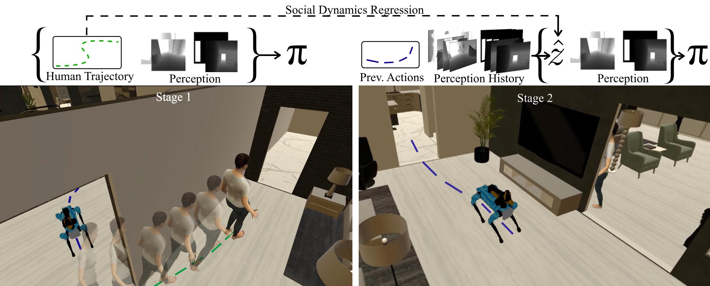

<div align="center">
<h1>Following the Human Thread in <br /> Social Navigation (ICLR 2025)</h1>
<h3> <i>L. Scofano¹*, A. Sampieri¹*, T. Campari²*, V. Sacco¹*</i></h3>
<h3> <i>I. Spinelli¹, L. Ballan³, F. Galasso¹ </i></h3>
 <h4> <i>Sapienza University of Rome¹, Fondazione Bruno Kessler(FBK)², University of Padova³
</i></h4>

## Overview

We propose the first Social Dynamics Adaptation model (SDA) based on the robot's state-action history to infer the social dynamics. We propose a two-stage Reinforcement Learning framework: the first learns to encode the human trajectories into social dynamics and learns a motion policy conditioned on this encoded information, the current status, and the previous action. Here, the trajectories are fully visible, i.e., assumed as privileged information. In the second stage, the trained policy operates without direct access to trajectories. Instead, the model infers the social dynamics solely from the history of previous actions and statuses in real-time.



</div>

## Installation

1. **Preparing conda env**

   Assuming you have [conda](https://docs.conda.io/projects/conda/en/latest/user-guide/install/) installed, let's prepare a conda env:
   ```bash
   # We require python>=3.9 and cmake>=3.14
   conda create -n sda python=3.9 cmake=3.14.0
   conda activate sda
   ```

1. **conda install habitat-sim**
   - Install habitat-sim with bullet physics
      ```
      conda install habitat-sim withbullet -c conda-forge -c aihabitat
      ```
      Note, for newer features added after the most recent release, you could install `aihabitat-nightly`. See Habitat-Sim's [installation instructions](https://github.com/facebookresearch/habitat-sim#installation) for more details. For **SDA**, these shouldn't be necessary.

1. **pip install habitat-lab sda's version**.  
Our repository was born from an habitat-lab snapshot, to make sure everything works properly, install the snapshot.
   

      ```bash
      git clone git@github.com:L-Scofano/SDA.git
      cd habitat-lab
      pip install -e habitat-lab  # install habitat_lab
      ```
1. **Install habitat-baselines**.

    The command above will install only core of Habitat-Lab. To include habitat_baselines along with all additional requirements, use the command below after installing habitat-lab:

      ```bash
      pip install -e habitat-baselines  # install habitat_baselines
      ```

## Train and Evaluation

Checkpoints are released [here](https://drive.google.com/drive/folders/1I1akcivfxHzEf8DIudXGMcVy0plWIJ70?usp=sharing).

Training and evaluation have been done on an HPC system.
Training and evaluation configuration files are located in [habitat-baselines/habitat-baselines/config/social_nav](https://github.com/S4b3/SocialNav3.0/tree/main/habitat-baselines/habitat_baselines/config/social_nav)


To install the required datasets, please follow the instructions provided in the [habitat-lab](https://github.com/facebookresearch/habitat-lab/tree/main/habitat-baselines#habitat-30-multi-agent-training) repository. For questions regarding datasets and simulator installation, please refer directly to their repository, as we are not responsible for Habitat's installation pipeline.


An example training call is as follows:

```
python -u -m habitat_baselines.run \
    --config-name=social_nav/social_nav.yaml \
    benchmark/multi_agent=hssd_spot_human_social_nav \
    habitat_baselines.evaluate=False \
    habitat_baselines.num_checkpoints=5000 \
    habitat_baselines.total_num_steps=1.0e9 \
    habitat_baselines.num_environments=24 \
    habitat_baselines.tensorboard_dir=tb_social_nav \
    habitat_baselines.video_dir=video_social_nav \
    habitat_baselines.checkpoint_folder=checkpoints_social_nav/stage_one/stage_one_d128_t20_aux_tasks_tommy \
    habitat_baselines.eval_ckpt_path_dir=checkpoints_social_nav/stage_one/stage_one_d128_t20_aux_tasks_tommy \
    habitat.task.actions.agent_0_base_velocity.longitudinal_lin_speed=10.0 \
    habitat.task.actions.agent_0_base_velocity.ang_speed=10.0 \
    habitat.task.actions.agent_0_base_velocity.allow_dyn_slide=True \
    habitat.task.actions.agent_0_base_velocity.enable_rotation_check_for_dyn_slide=False \
    habitat.task.actions.agent_1_oracle_nav_randcoord_action.lin_speed=10.0 \
    habitat.task.actions.agent_1_oracle_nav_randcoord_action.ang_speed=10.0 \
    habitat.task.actions.agent_1_oracle_nav_action.lin_speed=10.0 \
    habitat.task.actions.agent_1_oracle_nav_action.ang_speed=10.0 \
    habitat.task.measurements.social_nav_reward.facing_human_reward=3.0 \
    habitat.task.measurements.social_nav_reward.count_coll_pen=0.01 \
    habitat.task.measurements.social_nav_reward.max_count_colls=-1 \
    habitat.task.measurements.social_nav_reward.count_coll_end_pen=5 \
    habitat.task.measurements.social_nav_reward.use_geo_distance=True \
    habitat.task.measurements.social_nav_reward.facing_human_dis=3.0 \
    habitat.task.measurements.social_nav_seek_success.following_step_succ_threshold=400 \
    habitat.task.measurements.social_nav_seek_success.need_to_face_human=True \
    habitat.task.measurements.social_nav_seek_success.use_geo_distance=True \
    habitat.task.measurements.social_nav_seek_success.facing_threshold=0.5 \
    habitat.task.lab_sensors.humanoid_detector_sensor.return_image=True \
    habitat.task.lab_sensors.humanoid_detector_sensor.is_return_image_bbox=True \
    habitat.task.success_reward=10.0 \
    habitat.task.end_on_success=True \
    habitat.task.slack_reward=-0.1 \
    habitat.environment.max_episode_steps=1500 \
    habitat.simulator.kinematic_mode=True \
    habitat.simulator.ac_freq_ratio=4 \
    habitat.simulator.ctrl_freq=120 \
    habitat.simulator.agents.agent_0.joint_start_noise=0.0
```

## Acknowledgement 
Our code is built on top of the [habitat-lab](https://github.com/facebookresearch/habitat-lab) codebase.

## Citation
If you find SDA helpful, please consider citing:
```bibtex
@inproceedings{scofano2025followingthehumanthread,
      title={Following the Human Thread in Social Navigation}, 
      author={Luca Scofano and Alessio Sampieri and Tommaso Campari and Valentino Sacco and Indro Spinelli and Lamberto Ballan and Fabio Galasso},
      year={2025},
      booktitle={ICLR},
}
```

## Bugs and Issues
This repository is being maintained, if you find any problem with our code or need help configuring our framework don't hesitate in opening an issue. 

## Contact
If you have any questions, feel free to contact any of the main contributors. Thank you!