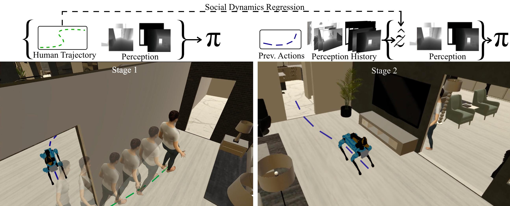

<h1>Following the Human Thread in Social Navigation (ICLR 2025)</h1>
<h3> <i>L. Scofano¹*, A. Sampieri¹*, T. Campari²*, V. Sacco¹*</i></h3>
<h3> <i>I. Spinelli¹, L. Ballan³, F. Galasso¹ </i></h3>
 <h4> <i>Sapienza University of Rome¹, Fondazione Bruno Kessler(FBK)², University of Padova³
</i></h4>

## Overview

We propose the first Social Dynamics Adaptation model (SDA) based on the robot's state-action history to infer the social dynamics. We propose a two-stage Reinforcement Learning framework: the first learns to encode the human trajectories into social dynamics and learns a motion policy conditioned on this encoded information, the current status, and the previous action. Here, the trajectories are fully visible, i.e., assumed as privileged information. In the second stage, the trained policy operates without direct access to trajectories. Instead, the model infers the social dynamics solely from the history of previous actions and statuses in real-time.

Code coming soon.
